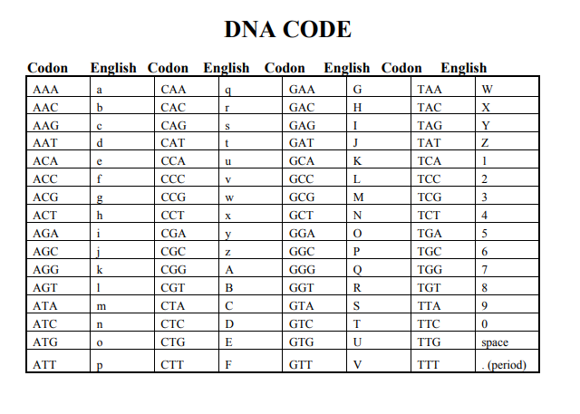

# DNA Sequence Decode

## Mapping

The mapping of DNA triplets to characters is defined in the `mapping` dictionary in the `dna.py` script. For example:

- 'AAA' maps to 'a'
- 'AAC' maps to 'b'
- 'AAG' maps to 'c'
- ...

You can view the complete mapping below:




### Running the Script

1. Clone the repository
2. Navigate to the directory containing `dna.py`
3. Modify with your encoded strings
4. Run the script using Python

```
python dna.py
```
